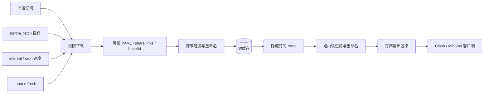

<div align="center">

# mihomo-proxy-manager

把多个 Clash/Mihomo 订阅整理成稳定、可控、可复用的订阅上游服务。

[](https://github.com/nerdneilsfield/mihomo-proxy-manager/actions/workflows/ci.yml)
[](https://ghcr.io/nerdneilsfield/mihomo-proxy-manager)
[](https://github.com/nerdneilsfield/mihomo-proxy-manager)
[](https://github.com/nerdneilsfield/mihomo-proxy-manager/blob/main/LICENSE)
[](https://github.com/nerdneilsfield/mihomo-proxy-manager/stargazers)

[English](README_EN.md) · [GitHub](https://github.com/nerdneilsfield/mihomo-proxy-manager) · [Issues](https://github.com/nerdneilsfield/mihomo-proxy-manager/issues)

</div>

## 这是什么

`mihomo-proxy-manager` 是 Clash/Mihomo 生态的订阅聚合上游服务。它从多个订阅源下载节点，解析 YAML、share link 或 base64 内容，按配置过滤、重命名，再按 route 输出 provider YAML、直连订阅等客户端可用格式。Mihomo `proxy-providers` YAML 是最初也是默认的输出场景。

它解决一个很具体的问题：原始订阅不适合直接分发给所有设备。你可能需要隐藏真实订阅地址、统一节点命名、把不同机场合并到一个 provider，或者给手机、电脑、路由器暴露不同的节点集合与订阅格式。这个服务把这些规则写进一份 TOML 配置，并把输出稳定成几个隐藏订阅路径。

## 适合场景

- 多个机场订阅需要合并、筛选、统一命名。
- Mihomo 客户端只订阅 provider YAML，不想暴露原始订阅 URL。
- 不同设备需要不同节点集合，比如手机只要低倍率节点，路由器只要特定地区节点。
- 上游订阅偶尔失败，但客户端仍希望拿到上一次的可用缓存。
- 想把订阅刷新、解析、过滤逻辑集中到服务端管理。

## 功能

- 聚合多个 source，按 route 输出 provider YAML 或其他订阅格式。
- 支持 Clash/Mihomo YAML provider、完整 YAML 配置、常见 share links 和 base64 订阅。
- 支持 `ss://`、`vmess://`、`vless://`、`trojan://`、`hysteria2://`。
- Route 格式研究与扩展边界见 [docs/route-formats.md](docs/route-formats.md)。
- 支持 source 层和 route 层的 include/exclude 正则过滤、类型过滤、前后缀重命名。
- 输出 Mihomo 兼容的 `proxies:` YAML。
- source 级 JSON 缓存，刷新失败时保留旧缓存。
- 支持 ETag 和 Last-Modified 条件请求。
- 支持 interval、cron、启动刷新和 jitter。
- 支持 `before_fetch` HTTP Action 插件。
- 默认限制私网 URL、重定向次数和响应大小，降低误抓内网和异常大响应的风险。

## 快速开始

### pip 安装

```bash
python -m pip install -r requirements.txt
python -m pip install -e . --no-deps
```

检查配置：

```bash
mpm check -c examples/config.toml
```

启动服务：

```bash
mpm serve -c examples/config.toml
```

手动刷新一个 source：

```bash
mpm refresh -c examples/config.toml airport_a
```

### Docker 运行

下面的运行示例会挂载三类路径：配置文件、缓存目录和日志目录。

可以使用 GHCR 镜像：

```bash
docker run --rm \
  -p 8080:8080 \
  -v "$PWD/examples/config.toml:/app/config.toml:ro" \
  -v "$PWD/data:/app/data" \
  -v "$PWD/logs:/app/logs" \
  ghcr.io/nerdneilsfield/mihomo-proxy-manager:latest
```

也可以使用 Docker Hub 镜像：

```bash
docker run --rm \
  -p 8080:8080 \
  -v "$PWD/examples/config.toml:/app/config.toml:ro" \
  -v "$PWD/data:/app/data" \
  -v "$PWD/logs:/app/logs" \
  docker.io/nerdneils/mihomo-proxy-manager:latest
```

本地构建镜像：

```bash
docker build -t mihomo-proxy-manager:local .
docker run --rm \
  -p 8080:8080 \
  -v "$PWD/examples/config.toml:/app/config.toml:ro" \
  -v "$PWD/data:/app/data" \
  -v "$PWD/logs:/app/logs" \
  mihomo-proxy-manager:local
```

容器默认执行：

```bash
mpm serve -c /app/config.toml
```

## 配置

配置文件使用 TOML。最小可用配置通常包含四块：

- `[server]`：服务监听地址、健康检查路径、状态路径。
- `[sources.*]`：上游订阅源，包含 URL、解析格式、刷新周期、过滤和命名规则。
- `[routes.*]`：对客户端暴露的订阅路径，以及这个 route 使用哪些 source。
- `[security]`：隐藏路径熵、私网 URL 访问等安全约束。

**注意：`user_agent` 必须写成 `clash-meta/<version>`、`clash.meta/<version>` 或 `mihomo/<version>`，其他格式一律拒绝。示例使用 `mihomo/1.19.5`，这是 Mihomo 已发布过的真实版本。不要填项目名或占位字符串——不少订阅源会根据 User-Agent 判断客户端类型。**

<details open>
<summary>常用配置片段</summary>

```toml
[server]
host = "127.0.0.1"
port = 8080
timezone = "Asia/Shanghai"
health_path = "/healthz"
status_path = "/s/X6HfeBRQz6xqk9S4dTV7gQwL2nP8aYcM"
route_refresh_wait = "10s"
public_base_url = "https://mpm.example.com"

[cache]
dir = "data/cache"
write_indent = 2
file_mode = "0600"
max_stale = "7d"

[logging.console]
enabled = true
level = "INFO"
colorize = true

[logging.file]
enabled = true
path = "logs/mihomo-proxy-manager.log"
level = "DEBUG"
rotation = "10 MB"
retention = "14 days"
compression = "gz"

[access_log]
enabled = true
db_path = "data/access/access.sqlite3"
retention = "30d"
trusted_proxies = ["127.0.0.1/32", "::1/128", "10.0.0.0/8", "172.16.0.0/12", "192.168.0.0/16"]
real_ip_headers = ["cf-connecting-ip", "true-client-ip", "x-forwarded-for", "x-real-ip"]

[access_log.file]
enabled = true
path = "logs/access.log"
rotation = "10 MB"
retention = "30 days"
compression = "gz"

[access_log.headers]
max_value_length = 512
stats_allowlist = ["user-agent", "host", "cf-ipcountry", "cf-ray"]
stats_max_rows = 5000

[access_log.status]
enabled = true
mask_ips = true
include_recent = false
recent_limit = 20
top_limit = 20

[http]
timeout = "30s"
user_agent = "mihomo/1.19.5"
max_response_size = "10 MB"
max_redirects = 3

[scheduler]
startup_refresh = true
startup_refresh_mode = "background"
jitter = "30s"
refresh_lock_timeout = "35s"

[security]
hidden_path_min_entropy_bits = 128
allow_private_network_urls = false

[parser]
default_format = "auto"
default_parse_error = "skip"

[output]
yaml_sort_keys = false
default_include_meta_comments = false

[sources.airport_a]
url = "https://example.com/sub"
format = "auto"
parse_error = "skip"

[sources.airport_a.fetch]
timeout = "30s"
user_agent = "mihomo/1.19.5"

[sources.airport_a.fetch.headers]
Authorization = "Bearer replace-me"

[sources.airport_a.refresh]
interval = "1h"
cron = ["0 4 * * *"]

[sources.airport_a.rename]
prefix = "[{source}] "

[sources.airport_a.filter]
include = "香港|日本|HK|JP"
exclude = "官网|剩余|过期"
exclude_types = ["http"]

[routes.phone]
path = "/p/CsYWr0BGzGQQmwq2X5eG5Qn8Kp4zR7vL.yaml"
sources = ["airport_a"]
require_all_sources = false

[routes.phone.output]
format = "provider"
include_meta_comments = false

[routes.phone.rename]
prefix = "[phone] "

[routes.phone.filter]
exclude = "倍率|测试"
```

</details>

<details>
<summary>字段说明</summary>

| 字段 | 说明 |
| --- | --- |
| `server.host` / `server.port` | HTTP 服务监听地址和端口。公网部署时建议放在反向代理后面。 |
| `server.health_path` | liveness 检查路径，只表示服务进程还活着。 |
| `server.status_path` | 状态页面路径，建议使用随机路径，不要公开给客户端。根路径返回 HTML 面板，`{status_path}/api` 返回 JSON API。 |
| `server.route_refresh_wait` | route 请求发现缓存缺失时，最多等待刷新完成的时间。 |
| `server.public_base_url` | 公网访问根 URL。Surfboard 和 Quantumult X import companion 需要它生成稳定的绝对订阅地址。 |
| `cache.dir` | source JSON 缓存目录。缓存里包含代理节点信息，应保护目录权限。 |
| `cache.max_stale` | 缓存最长可用时间，超过后 route 会把该 source 视为不可用。 |
| `http.max_response_size` | 上游订阅响应大小上限，避免异常响应占用过多内存。 |
| `http.max_redirects` | 下载订阅和插件请求允许的最大重定向次数。 |
| `scheduler.startup_refresh_mode` | `background` 表示启动后后台刷新；`blocking` 表示刷新完成后再接流量。 |
| `security.hidden_path_min_entropy_bits` | route path 随机部分的最低估算熵，建议不低于 128。 |
| `security.allow_private_network_urls` | 是否允许访问私网、localhost 和保留地址。生产环境建议保持 `false`。 |
| `sources.<name>.format` | `auto`、`yaml`、`share-links`。通常使用 `auto`。 |
| `sources.<name>.parse_error` | `skip` 会跳过坏节点；`fail` 会让整个 source 刷新失败。 |
| `sources.<name>.filter.include` | 只保留名称匹配该正则的节点。 |
| `sources.<name>.filter.exclude` | 排除名称匹配该正则的节点。 |
| `sources.<name>.rename.prefix` | 给 source 节点名添加前缀，可使用 `{source}`。 |
| `routes.<name>.path` | 客户端订阅路径。它本身就是 bearer secret。 |
| `routes.<name>.sources` | 当前 route 聚合的 source 名称列表。 |
| `routes.<name>.require_all_sources` | 为 `true` 时，任一 source 不可用都会让该 route 返回 `503`。 |
| `routes.<name>.output.format` | route 输出格式：`provider`、`auto`、`xray-uri`、`quantumult-x`、`surfboard`。 |

</details>

访问配置里 `format = "provider"` 的订阅路径后，客户端会收到类似输出：

```yaml
proxies:
  - name: "[phone] [airport_a] HK 01"
    type: vmess
    server: example.com
    port: 443
```

完整可运行模板见 [examples/config.toml](examples/config.toml)，里面包含两个订阅源、插件、provider 格式 route、auto 单 URL route、v2rayN / Quantumult X / Surfboard 直连订阅 route、文件日志和 Docker 运行所需目录。

<details>
<summary>功能用法速查</summary>

### 订阅源抓取

```toml
[sources.airport_a]
url = "https://example.com/sub"
format = "auto"        # auto | yaml | share-links
parse_error = "skip"   # skip | fail

[sources.airport_a.fetch]
timeout = "30s"
user_agent = "mihomo/1.19.5"

[sources.airport_a.fetch.headers]
Authorization = "Bearer replace-me"
```

### 定时刷新

```toml
[sources.airport_a.refresh]
interval = "1h"
cron = ["0 4 * * *"]
```

`interval` 和 `cron` 可以同时使用。`cron` 使用 `[server] timezone` 指定的时区。

### source 级过滤和重命名

```toml
[sources.airport_a.rename]
prefix = "[{source}] "
suffix = ""

[sources.airport_a.filter]
include = "香港|日本|HK|JP"
exclude = "官网|剩余|过期|套餐"
include_types = ["ss", "vmess", "vless", "trojan", "hysteria2"]
exclude_types = ["http"]
```

source 级规则会在缓存写入前执行，适合清理上游订阅里的无用节点。

### route 级过滤和重命名

```toml
[routes.phone]
path = "/p/CsYWr0BGzGQQmwq2X5eG5Qn8Kp4zR7vL.yaml"
sources = ["airport_a", "airport_b"]
require_all_sources = false

[routes.phone.rename]
prefix = "[phone] "

[routes.phone.filter]
exclude = "倍率|测试|Traffic"
```

route 级规则会在多个 source 聚合后执行，适合按设备或场景切出不同订阅输出。

### 输出元信息注释

```toml
[routes.gateway.output]
format = "provider"
include_meta_comments = true
```

开启后，输出 YAML 顶部会包含生成时间、路由名、source 数量和节点数量。不会写入上游 URL、header、token 或隐藏路径。

### 直接订阅输出

```toml
[server]
public_base_url = "https://mpm.example.com"

[routes.v2rayn.output]
format = "xray-uri"
encoding = "base64" # base64 | plain

[routes.qx.output]
format = "quantumult-x"
resource_tag = "MPM"

[routes.surfboard.output]
format = "surfboard"
test_url = "http://www.gstatic.com/generate_204"
```

`xray-uri` 可直接给 v2rayN 等客户端订阅，默认返回 base64 URI payload。`quantumult-x` 主路由返回 server lines，并额外注册 `-import` 一键导入端点。`surfboard` 主路由返回最小完整 profile，并额外注册 `-nodes` 给 `policy-path` 使用；当前客户端兼容输出为 `ss`、`trojan`、`vmess`，`hysteria2` 和 `vless` 会被跳过。

### 单 URL 自动订阅

`format = "auto"` 只对该 route 开启自动格式选择。固定格式 route 仍忽略
`target`、`format`、`flag`、`client` 查询参数和 `User-Agent`。

```toml
[routes.auto.output]
format = "auto"
auto_default = "provider"
```

同一路径可供不同客户端直接订阅：

```text
https://mpm.example.com/p/token?target=clash
https://mpm.example.com/p/token?target=surfboard
https://mpm.example.com/p/token?target=quanx
https://mpm.example.com/p/token?target=v2rayn
```

查询优先级为 `target > format > flag > client`，整体选择顺序为
`explicit query target > companion suffix > User-Agent > auto_default`。
`target=auto` 或空值表示没有显式查询目标；此时 `-nodes` 仍选 Surfboard，
`-import` 仍选 Quantumult X。

`format = "auto"` 必须配置 `server.public_base_url`，因为 Surfboard 和
Quantumult X 需要嵌入绝对订阅 URL。

### HTTP Action 插件

```toml
[sources.airport_a.plugins.before_fetch.turn_on_airport]
on_failure = "abort" # abort | continue

[plugins.turn_on_airport]
type = "http_action"
method = "POST"
url = "https://example.com/api/switch"
success_status = [200, 204]
timeout = "10s"
body = "{\"enabled\":true}"

[plugins.turn_on_airport.headers]
Authorization = "Bearer replace-me"
Content-Type = "application/json"
```

插件会在刷新订阅前执行。`abort` 表示插件失败就保留旧缓存并停止本次刷新；`continue` 表示记录失败但继续抓取订阅。

### DNS 解析节点域名

默认不改写节点域名。需要时在 source 上显式启用：

```toml
[dns]
servers = ["udp://1.1.1.1:53", "https://dns.google/dns-query"]
timeout = "5s"
failure = "keep"

[sources.airport_a.dns]
enabled = true
servers = ["tls://1.1.1.1:853?servername=cloudflare-dns.com"]
failure = "drop"
```

`failure` 可选 `keep`、`drop`、`fail`：解析失败时分别为保留原域名、丢弃节点、整次刷新失败。仅替换节点顶层 `server` 字段；已存在的 `servername`、`sni` 与 `ws-opts.headers.Host` 不会被 IP 覆盖。启用 DNS 的 source 会跳过 ETag/Last-Modified 条件请求。

默认只解析 A 记录（IPv4）。如需 IPv6，在 `[dns]` 或 `[sources.<name>.dns]` 中设置 `enable_ipv6 = true`，解析器会额外查询 AAAA 记录。

DNS 服务器支持 `udp://`、`tcp://`、`tls://`、`https://` 四种 scheme，运行时会先解析 DNS 服务器主机名并 pin 到公网 IP，避免 DNS rebinding。

### 限制客户端 User-Agent

```toml
[routes.phone.access]
user_agent = ["mihomo/*", "clash-meta/*", "clash.meta/*"]
```

匹配使用大小写敏感的 shell glob（`fnmatch`）。未配置或配置为空列表时保持开放。仅作用于已配置的订阅路由，包括主 route path 及其 companion path，例如 `-nodes` 和 `-import`；不影响 `/healthz` 等系统端点。

### 文件日志

```toml
[logging.file]
enabled = true
path = "logs/mihomo-proxy-manager.log"
level = "DEBUG"
rotation = "10 MB"
retention = "14 days"
compression = "gz"
```

Docker 运行时要挂载 `logs` 到 `/app/logs`，否则日志会留在容器文件系统里。

### 访问审计日志

`[access_log]` 开启后，服务会把已匹配订阅 route 的访问事件写入 SQLite，默认保留 30 天；`logs/access.log` 是单独的人类可读访问日志，不会混入普通 Loguru 文件日志。审计数据包含个人数据：IP 地址、User-Agent、route path、时间戳、选中的已清洗 header、响应状态、响应大小和耗时。header 值入库前会先按敏感名、secret、长度做脱敏和截断。

`trusted_proxies` 决定是否信任 `CF-Connecting-IP`、`True-Client-IP`、`X-Forwarded-For`、`X-Real-IP`。默认信任 loopback 与 RFC1918 Docker/LAN 网段，便于零配置反向代理；若服务可被私网或 LAN 客户端直连，请改成精确反向代理 IP/CIDR，否则客户端可伪造这些 header。反向代理必须覆盖或清洗 `X-Forwarded-For`；做不到时，从 `real_ip_headers` 删除它。

状态页只展示聚合统计，永不展示完整 `headers_json`。访问统计暴露在 `status_path`，所以保持 `status_path` 高熵且不公开；不要把高熵私有 header 放进 `access_log.headers.stats_allowlist`。状态页默认遮蔽 IP，默认不显示 recent rows。

关闭全部审计存储和访问文件日志：

```toml
[access_log]
enabled = false
```

`mpm check` 可能因现有文件系统校验创建目录，但不会创建 SQLite DB 文件或访问日志文件。

</details>

## 设计

核心设计是把“订阅源刷新”和“路由渲染”分开。订阅源只管从上游拿到可用节点并缓存结果；路由只管读取缓存、组合节点，再按配置生成客户端需要的订阅输出。provider YAML 是原始且默认的输出，其他 route format 在同一管线中渲染。上游失败时旧缓存仍能继续服务；客户端请求也不必直接等待每一次上游下载。



<details>
<summary>刷新流程</summary>

1. 获取订阅源刷新锁，避免同一个源在同一进程内重复刷新。
2. 执行 `before_fetch` 插件。比如某些订阅源需要先调用接口打开服务。
3. 下载上游订阅。下载器会限制私网地址、重定向次数和响应大小。
4. 如果旧缓存里有验证信息，刷新时会带上条件请求头。
5. 解析订阅，统一成 Mihomo proxy dictionary。
6. 执行源级过滤和重命名。
7. 写入源缓存。写入使用临时文件和原子替换，避免客户端读到半写文件。
8. 如果刷新失败，旧缓存不会被删除。

</details>

<details>
<summary>请求流程</summary>

1. 服务只匹配配置中声明的精确订阅路径。
2. 路由从内存或文件读取订阅源缓存。
3. 如果缓存缺失，会触发刷新并等待一小段时间。
4. `require_all_sources = false` 时，只要有可用节点就返回；完全没有节点才返回 `503`。
5. `require_all_sources = true` 时，任一订阅源不可用都会返回 `503`。
6. 路由级过滤和重命名在聚合后执行。
7. 最后修复重复节点名，并按 route output format 输出。

</details>

## 安全

- 订阅路径是 bearer secret。路径泄露后，拿到路径的人就能获取该 route 输出。
- 生产环境请使用 HTTPS，或放在可信反向代理后面。
- `status_path` 也建议使用高熵随机路径。
- `status_path` 会暴露访问聚合统计；不要公开，并避免 allowlist 高熵私有 header。
- 上游订阅 URL、插件 header、节点 UUID/password 都应视为敏感信息。
- 默认禁止抓取私网、localhost 和保留地址。只在明确需要内网订阅源时才考虑放开。
- 缓存文件保存代理节点信息，建议把运行目录权限控制在服务用户范围内。

## 开发

安装开发依赖：

```bash
make install
```

运行常用检查：

```bash
make test
make lint
make typecheck
make check
```

也可以不用 `make`，直接运行：

```bash
python -m pip install -r requirements.txt
python -m pip install -e . --no-deps
python -m ruff check .
python -m ty check
python -m pytest -q
```

项目主要目录：

```text
src/mihomo_proxy_manager/
  cli.py          # mpm serve/check/refresh
  config.py       # TOML 加载和验证
  app.py          # Starlette HTTP app
  scheduler.py    # interval / cron 刷新调度
  refresher.py    # source 刷新编排
  fetcher.py      # 受限下载器
  parsers/        # YAML 和 share-link 解析
  plugins/        # HTTP Action 插件
  cache.py        # source JSON 缓存
  transform.py    # 过滤、重命名、重复名修复
  render.py       # provider YAML 渲染
```

## 许可证

许可证见 [LICENSE](LICENSE)。
