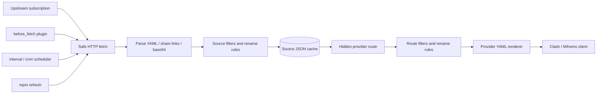

<div align="center">

# mihomo-proxy-manager

A small upstream provider service that turns multiple Clash/Mihomo subscriptions into stable, reusable provider feeds.

[](https://github.com/nerdneilsfield/mihomo-proxy-manager/actions/workflows/ci.yml)
[](https://ghcr.io/nerdneilsfield/mihomo-proxy-manager)
[](https://github.com/nerdneilsfield/mihomo-proxy-manager)
[](https://github.com/nerdneilsfield/mihomo-proxy-manager/blob/main/LICENSE)
[](https://github.com/nerdneilsfield/mihomo-proxy-manager/stargazers)

[中文](README.md) · [GitHub](https://github.com/nerdneilsfield/mihomo-proxy-manager) · [Issues](https://github.com/nerdneilsfield/mihomo-proxy-manager/issues)

</div>

## What It Is

`mihomo-proxy-manager` is an upstream provider service for Clash/Mihomo. It downloads proxy nodes from multiple subscription sources, parses YAML, share links, or base64 payloads, applies configurable filters and renaming rules, then returns Mihomo-compatible `proxy-providers` YAML.

The project is built for a practical problem: raw subscription URLs are often not suitable for every device. You may want to hide the original subscription URL, normalize node names, combine multiple providers, or expose different node sets for phones, laptops, and routers. This service keeps those rules in a TOML file and exposes stable hidden provider routes.

## When To Use It

- You have multiple subscription sources and want one clean provider feed.
- You want Mihomo clients to consume provider YAML without seeing raw upstream URLs.
- Different devices need different node sets.
- Upstream subscriptions sometimes fail, but clients should still receive the last valid cache.
- You prefer centralizing refresh, parsing, filtering, and naming rules on a server.

## Features

- Aggregates multiple sources and exposes different provider routes.
- Parses Clash/Mihomo provider YAML, full YAML configs, common share links, and base64 subscriptions.
- Supports `ss://`, `vmess://`, `vless://`, `trojan://`, and `hysteria2://`.
- Route format research and extension boundaries are documented in [docs/route-formats.md](docs/route-formats.md).
- Supports source-level and route-level regex filters, type filters, prefixes, and suffixes.
- Renders Mihomo-compatible `proxies:` YAML.
- Keeps source-level JSON caches and preserves old cache on refresh failure.
- Supports ETag and Last-Modified conditional requests.
- Supports interval, cron, startup refresh, and jitter.
- Supports a `before_fetch` HTTP Action plugin hook.
- Limits private-network URLs, redirect count, and response size by default.

## Quick Start

### Install With pip

```bash
python -m pip install -r requirements.txt
python -m pip install -e . --no-deps
```

Validate a config:

```bash
mpm check -c examples/config.toml
```

Run the service:

```bash
mpm serve -c examples/config.toml
```

Refresh one source manually:

```bash
mpm refresh -c examples/config.toml airport_a
```

### Run With Docker

The examples below mount three paths: the config file, the cache directory, and the log directory.

Use the GHCR image:

```bash
docker run --rm \
  -p 8080:8080 \
  -v "$PWD/examples/config.toml:/app/config.toml:ro" \
  -v "$PWD/data:/app/data" \
  -v "$PWD/logs:/app/logs" \
  ghcr.io/nerdneilsfield/mihomo-proxy-manager:latest
```

Or use the Docker Hub image:

```bash
docker run --rm \
  -p 8080:8080 \
  -v "$PWD/examples/config.toml:/app/config.toml:ro" \
  -v "$PWD/data:/app/data" \
  -v "$PWD/logs:/app/logs" \
  docker.io/nerdneils/mihomo-proxy-manager:latest
```

Build locally:

```bash
docker build -t mihomo-proxy-manager:local .
docker run --rm \
  -p 8080:8080 \
  -v "$PWD/examples/config.toml:/app/config.toml:ro" \
  -v "$PWD/data:/app/data" \
  -v "$PWD/logs:/app/logs" \
  mihomo-proxy-manager:local
```

The container runs this command by default:

```bash
mpm serve -c /app/config.toml
```

## Configuration

Configuration is written in TOML. A useful config usually has four parts:

- `[server]`: listen address, health path, and status path.
- `[sources.*]`: upstream subscriptions, fetch options, refresh policy, filters, and naming rules.
- `[routes.*]`: provider routes exposed to clients and the sources each route uses.
- `[security]`: hidden path entropy and private-network URL policy.

**Important: `user_agent` must use `clash-meta/<version>`, `clash.meta/<version>`, or `mihomo/<version>`. Other formats are rejected. The example uses `mihomo/1.19.5`, a real released Mihomo version. Do not use the project name or a placeholder string; some subscription providers change behavior based on the User-Agent.**

<details open>
<summary>Common configuration snippet</summary>

```toml
[server]
host = "127.0.0.1"
port = 8080
timezone = "Asia/Shanghai"
health_path = "/healthz"
status_path = "/s/X6HfeBRQz6xqk9S4dTV7gQwL2nP8aYcM"
route_refresh_wait = "10s"
public_base_url = "https://mpm.example.com"

[cache]
dir = "data/cache"
write_indent = 2
file_mode = "0600"
max_stale = "7d"

[logging.console]
enabled = true
level = "INFO"
colorize = true

[logging.file]
enabled = true
path = "logs/mihomo-proxy-manager.log"
level = "DEBUG"
rotation = "10 MB"
retention = "14 days"
compression = "gz"

[http]
timeout = "30s"
user_agent = "mihomo/1.19.5"
max_response_size = "10 MB"
max_redirects = 3

[scheduler]
startup_refresh = true
startup_refresh_mode = "background"
jitter = "30s"
refresh_lock_timeout = "35s"

[security]
hidden_path_min_entropy_bits = 128
allow_private_network_urls = false

[parser]
default_format = "auto"
default_parse_error = "skip"

[output]
yaml_sort_keys = false
default_include_meta_comments = false

[sources.airport_a]
url = "https://example.com/sub"
format = "auto"
parse_error = "skip"

[sources.airport_a.fetch]
timeout = "30s"
user_agent = "mihomo/1.19.5"

[sources.airport_a.fetch.headers]
Authorization = "Bearer replace-me"

[sources.airport_a.refresh]
interval = "1h"
cron = ["0 4 * * *"]

[sources.airport_a.rename]
prefix = "[{source}] "

[sources.airport_a.filter]
include = "香港|日本|HK|JP"
exclude = "官网|剩余|过期"
exclude_types = ["http"]

[routes.phone]
path = "/p/CsYWr0BGzGQQmwq2X5eG5Qn8Kp4zR7vL.yaml"
sources = ["airport_a"]
require_all_sources = false

[routes.phone.output]
format = "provider"
include_meta_comments = false

[routes.phone.rename]
prefix = "[phone] "

[routes.phone.filter]
exclude = "倍率|测试"
```

</details>

<details>
<summary>Important fields</summary>

| Field | Meaning |
| --- | --- |
| `server.host` / `server.port` | HTTP listen address and port. Put the service behind a reverse proxy for public deployments. |
| `server.health_path` | Liveness path. It only means the process is alive. |
| `server.status_path` | Status path. Use a random path and avoid exposing it to clients. The root path returns an HTML dashboard; `{status_path}/api` returns the JSON API. |
| `server.route_refresh_wait` | How long a route request waits when a required cache is missing. |
| `server.public_base_url` | Public base URL. Surfboard and Quantumult X import companions use it to generate stable absolute subscription URLs. |
| `cache.dir` | Directory for source JSON cache files. Cache files contain proxy data. |
| `cache.max_stale` | Maximum age for cache entries. Older entries are treated as unavailable. |
| `http.max_response_size` | Maximum upstream response size. |
| `http.max_redirects` | Maximum redirect count for subscription downloads and plugin requests. |
| `scheduler.startup_refresh_mode` | `background` starts serving first; `blocking` waits for startup refreshes first. |
| `security.hidden_path_min_entropy_bits` | Minimum estimated entropy for hidden route paths. 128 or higher is recommended. |
| `security.allow_private_network_urls` | Allows private, localhost, and reserved addresses. Keep this `false` in production unless you need it. |
| `sources.<name>.format` | `auto`, `yaml`, or `share-links`. `auto` is the usual choice. |
| `sources.<name>.parse_error` | `skip` drops bad nodes; `fail` fails the whole source refresh. |
| `sources.<name>.filter.include` | Keeps nodes whose names match the regex. |
| `sources.<name>.filter.exclude` | Drops nodes whose names match the regex. |
| `sources.<name>.rename.prefix` | Adds a prefix to source-level node names. `{source}` is available. |
| `routes.<name>.path` | Provider path consumed by clients. This path is a bearer secret. |
| `routes.<name>.sources` | Sources included by this route. |
| `routes.<name>.require_all_sources` | If `true`, any unavailable source makes the route return `503`. |

</details>

A provider route returns YAML like this:

```yaml
proxies:
  - name: "[phone] [airport_a] HK 01"
    type: vmess
    server: example.com
    port: 443
```

See [examples/config.toml](examples/config.toml) for a complete runnable template with two sources, a plugin, provider routes, v2rayN / Quantumult X / Surfboard direct subscription routes, file logging, and Docker-friendly runtime paths.

<details>
<summary>Feature usage quick reference</summary>

### Fetch an upstream subscription

```toml
[sources.airport_a]
url = "https://example.com/sub"
format = "auto"        # auto | yaml | share-links
parse_error = "skip"   # skip | fail

[sources.airport_a.fetch]
timeout = "30s"
user_agent = "mihomo/1.19.5"

[sources.airport_a.fetch.headers]
Authorization = "Bearer replace-me"
```

### Schedule refreshes

```toml
[sources.airport_a.refresh]
interval = "1h"
cron = ["0 4 * * *"]
```

`interval` and `cron` can be used together. `cron` uses the timezone from `[server] timezone`.

### Source-level filters and renaming

```toml
[sources.airport_a.rename]
prefix = "[{source}] "
suffix = ""

[sources.airport_a.filter]
include = "香港|日本|HK|JP"
exclude = "官网|剩余|过期|套餐"
include_types = ["ss", "vmess", "vless", "trojan", "hysteria2"]
exclude_types = ["http"]
```

Source-level rules run before the source cache is written. Use them to clean noisy upstream subscriptions.

### Route-level filters and renaming

```toml
[routes.phone]
path = "/p/CsYWr0BGzGQQmwq2X5eG5Qn8Kp4zR7vL.yaml"
sources = ["airport_a", "airport_b"]
require_all_sources = false

[routes.phone.rename]
prefix = "[phone] "

[routes.phone.filter]
exclude = "倍率|测试|Traffic"
```

Route-level rules run after source aggregation. Use them to expose different provider feeds for different devices or scenarios.

### Metadata comments in provider output

```toml
[routes.gateway.output]
format = "provider"
include_meta_comments = true
```

When enabled, the YAML output includes generation time, route name, source count, and node count. It does not include upstream URLs, headers, tokens, or hidden paths.

### Direct Subscription Outputs

```toml
[server]
public_base_url = "https://mpm.example.com"

[routes.v2rayn.output]
format = "xray-uri"
encoding = "base64" # base64 | plain

[routes.qx.output]
format = "quantumult-x"
resource_tag = "MPM"

[routes.surfboard.output]
format = "surfboard"
test_url = "http://www.gstatic.com/generate_204"
```

`xray-uri` is directly subscribable by v2rayN-style clients and returns a base64 URI payload by default. `quantumult-x` returns server lines on the main route and registers a `-import` one-click import endpoint. `surfboard` returns a minimal full profile on the main route and registers `-nodes` for `policy-path`.

### HTTP Action plugin

```toml
[sources.airport_a.plugins.before_fetch.turn_on_airport]
on_failure = "abort" # abort | continue

[plugins.turn_on_airport]
type = "http_action"
method = "POST"
url = "https://example.com/api/switch"
success_status = [200, 204]
timeout = "10s"
body = "{\"enabled\":true}"

[plugins.turn_on_airport.headers]
Authorization = "Bearer replace-me"
Content-Type = "application/json"
```

The plugin runs before the subscription is fetched. `abort` keeps the old cache and stops the refresh on plugin failure; `continue` logs the failure and still fetches the subscription.

### DNS resolution for node hostnames

By default, node hostnames are passed through unchanged. To resolve them to IP addresses, opt in per source:

```toml
[dns]
servers = ["udp://1.1.1.1:53", "https://dns.google/dns-query"]
timeout = "5s"
failure = "keep"

[sources.airport_a.dns]
enabled = true
servers = ["tls://1.1.1.1:853?servername=cloudflare-dns.com"]
failure = "drop"
```

`failure` accepts `keep`, `drop`, or `fail` — keep the original hostname, drop the node, or fail the whole refresh respectively. Only the top-level `server` field is replaced; existing `servername`, `sni`, and `ws-opts.headers.Host` are preserved. Sources with DNS enabled skip ETag/Last-Modified conditional requests so each refresh re-resolves.

By default only A records (IPv4) are queried. To enable IPv6, set `enable_ipv6 = true` in `[dns]` or `[sources.<name>.dns]`; the resolver will additionally query AAAA records.

DNS servers may use `udp://`, `tcp://`, `tls://`, or `https://`. The DNS server hostname is resolved once per query and pinned to a public IP at connect time, preventing DNS rebinding attacks.

### Restrict provider client User-Agent

```toml
[routes.phone.access]
user_agent = ["mihomo/*", "clash-meta/*", "clash.meta/*"]
```

Patterns are matched case-sensitively using shell-style glob (`fnmatch`). When unset or set to an empty list, the route stays open. Access control applies only to provider routes; system endpoints such as `/healthz` are unaffected.

### File logging

```toml
[logging.file]
enabled = true
path = "logs/mihomo-proxy-manager.log"
level = "DEBUG"
rotation = "10 MB"
retention = "14 days"
compression = "gz"
```

When running with Docker, mount `logs` to `/app/logs`; otherwise logs stay inside the container filesystem.

</details>

## Design

The service separates source refresh from route rendering. A source is responsible for turning one upstream subscription into cached proxy records. A route is responsible for combining cached records into the provider YAML that a client needs. This keeps upstream failures, client requests, and output formatting from blocking each other unnecessarily.



<details>
<summary>Refresh flow</summary>

1. Acquire the source refresh lock to avoid duplicate refreshes in the same process.
2. Run `before_fetch` plugins. Some providers need an HTTP action before the subscription is downloaded.
3. Download the upstream subscription. The HTTP client limits private-network access, redirect count, and response size.
4. Send conditional request headers when the cache has ETag or Last-Modified metadata.
5. Parse the subscription into Mihomo proxy dictionaries.
6. Apply source-level filters and rename rules.
7. Write the source JSON cache with a temporary file and atomic replace.
8. Keep the old cache when refresh fails.

</details>

<details>
<summary>Request flow</summary>

1. Match the exact hidden route path from the config.
2. Load source caches from memory or disk.
3. Trigger a refresh and wait briefly when a required cache is missing.
4. If `require_all_sources = false`, return available nodes when at least one source is usable.
5. If `require_all_sources = true`, return `503` when any source remains unavailable.
6. Apply route-level filters and rename rules after aggregation.
7. Repair duplicate final node names and render YAML.

</details>

## Security

- Provider paths are bearer secrets. Anyone with the path can fetch the provider.
- Use HTTPS or a trusted reverse proxy in production.
- Use a high-entropy `status_path` as well.
- Treat upstream URLs, plugin headers, node UUIDs, and node passwords as sensitive data.
- Private, localhost, and reserved URLs are blocked by default.
- Cache files contain proxy data. Keep runtime directory permissions tight.

## Development

Install development dependencies:

```bash
make install
```

Run common checks:

```bash
make test
make lint
make typecheck
make check
```

The direct pip path is:

```bash
python -m pip install -r requirements.txt
python -m pip install -e . --no-deps
python -m ruff check .
python -m ty check
python -m pytest -q
```

Main project layout:

```text
src/mihomo_proxy_manager/
  cli.py          # mpm serve/check/refresh
  config.py       # TOML loading and validation
  app.py          # Starlette HTTP app
  scheduler.py    # interval / cron refresh scheduling
  refresher.py    # source refresh orchestration
  fetcher.py      # safer HTTP downloads
  parsers/        # YAML and share-link parsers
  plugins/        # HTTP Action plugin
  cache.py        # source JSON cache
  transform.py    # filters, rename rules, duplicate-name repair
  render.py       # provider YAML rendering
```

## License

Released under the license declared in [LICENSE](LICENSE).
