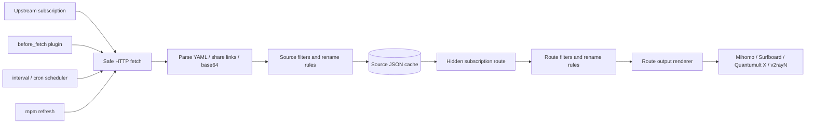

<div align="center">

# mihomo-proxy-manager

A small upstream subscription service that turns multiple Clash/Mihomo subscriptions into stable, reusable route outputs.

[](https://github.com/nerdneilsfield/mihomo-proxy-manager/actions/workflows/ci.yml)
[](https://ghcr.io/nerdneilsfield/mihomo-proxy-manager)
[](https://github.com/nerdneilsfield/mihomo-proxy-manager)
[](https://github.com/nerdneilsfield/mihomo-proxy-manager/blob/main/LICENSE)
[](https://github.com/nerdneilsfield/mihomo-proxy-manager/stargazers)

[中文](README.md) · [GitHub](https://github.com/nerdneilsfield/mihomo-proxy-manager) · [Issues](https://github.com/nerdneilsfield/mihomo-proxy-manager/issues)

</div>

## What It Is

`mihomo-proxy-manager` is an upstream subscription service for Clash/Mihomo and related clients. It downloads proxy nodes from multiple subscription sources, parses YAML, share links, or base64 payloads, applies configurable filters and renaming rules, then renders route outputs such as provider YAML or direct subscription payloads. Mihomo-compatible `proxy-providers` YAML is the original and default output.

The project solves a practical problem: raw subscription URLs rarely suit every device. You may want to hide the original subscription URL, normalize node names, combine multiple providers, or expose different node sets and subscription formats for phones, laptops, and routers. This service keeps those rules in a TOML file and exposes stable hidden subscription routes.

## When To Use It

- You have multiple subscription sources and want one clean provider YAML or client-specific subscription output.
- You want Mihomo clients to consume provider YAML without seeing raw upstream URLs.
- Different devices need different node sets.
- Different clients need the same node pool in different subscription formats, such as Mihomo, Surfboard, Quantumult X, and v2rayN.
- You want one route to return different formats through `?target=`, `?format=`, `?flag=`, `?client=`, or User-Agent detection.
- Upstream subscriptions sometimes fail, but clients should still receive the last valid cache.
- You prefer centralizing refresh, parsing, filtering, and naming rules on a server.
- You need route access audit records: real client IP, User-Agent, selected headers, aggregate stats, and a human-readable access log.

## Features

- Aggregates multiple sources and exposes Mihomo provider, Surfboard, Quantumult X, v2rayN/Xray URI, and other route outputs.
- Supports fixed-format routes and `format = "auto"` routes for one-URL multi-client subscriptions.
- Supports query selectors and User-Agent detection: `target`, `format`, `flag`, and `client` take precedence over User-Agent.
- Parses Clash/Mihomo provider YAML, full YAML configs, common share links, and base64 subscriptions.
- Supports `ss://`, `vmess://`, `vless://`, `trojan://`, and `hysteria2://`.
- Preserves common vless reality / vision fields in compatible outputs.
- Route format research and extension boundaries: [docs/route-formats.md](docs/route-formats.md).
- Source-level and route-level regex filters, type filters, prefixes, and suffixes.
- Renders Mihomo-compatible `proxies:` YAML with optional metadata comments.
- Source-level JSON caches preserved on refresh failure.
- ETag and Last-Modified conditional requests.
- Interval, cron, startup refresh, and jitter.
- Per-source opt-in DNS resolution for node hostnames, with UDP/TCP/DoT/DoH servers.
- `before_fetch` HTTP Action plugin hook.
- Route-level User-Agent access control.
- SQLite access audit, separate human-readable access log, status-page access stats, and IP/header aggregates.
- HTML status dashboard plus `{status_path}/api` JSON API.
- Private-network URLs, redirect count, and response size limited by default.

## Current Capability Matrix

| Capability | Status | Notes |
| --- | --- | --- |
| Source input `auto` | Implemented | Detects YAML, share links, and base64 payloads. |
| Source input `yaml` | Implemented | Supports provider YAML and full Clash/Mihomo YAML configs. |
| Source input `share-links` | Implemented | Parses raw share links or base64-decoded share links. |
| Route output `provider` | Implemented | Returns Mihomo/Clash provider YAML: `proxies:`. |
| Route output `xray-uri` | Implemented | Returns `ss://`, `vmess://`, `vless://`, `trojan://`, and `hysteria2://` URIs; base64 by default. |
| Route output `quantumult-x` | Implemented | Main route returns server lines; optional `-import` one-click import. |
| Route output `surfboard` | Implemented | Main route returns a minimal full profile; `-nodes` returns policy-path nodes. |
| Route output `auto` | Implemented | Chooses output by query, companion suffix, User-Agent, then `auto_default`. |
| `sing-box` / `loon` | Aliases reserved, renderer not implemented | Query/UA can recognize them as future targets, but no usable renderer exists yet. |
| Access audit | Implemented | SQLite + separate access log + status aggregates, default 30-day retention. |

## Quick Start

### Install With pip

```bash
python -m pip install -r requirements.txt
python -m pip install -e . --no-deps
```

Validate a config:

```bash
mpm check -c examples/config.toml
```

Run the service:

```bash
mpm serve -c examples/config.toml
```

Refresh one source manually:

```bash
mpm refresh -c examples/config.toml airport_a
```

### Run With Docker

The examples below mount three paths: the config file, the cache directory, and the log directory.

Use the GHCR image:

```bash
docker run --rm \
  -p 8080:8080 \
  -v "$PWD/examples/config.toml:/app/config.toml:ro" \
  -v "$PWD/data:/app/data" \
  -v "$PWD/logs:/app/logs" \
  ghcr.io/nerdneilsfield/mihomo-proxy-manager:latest
```

Or use the Docker Hub image:

```bash
docker run --rm \
  -p 8080:8080 \
  -v "$PWD/examples/config.toml:/app/config.toml:ro" \
  -v "$PWD/data:/app/data" \
  -v "$PWD/logs:/app/logs" \
  docker.io/nerdneils/mihomo-proxy-manager:latest
```

Build locally:

```bash
docker build -t mihomo-proxy-manager:local .
docker run --rm \
  -p 8080:8080 \
  -v "$PWD/examples/config.toml:/app/config.toml:ro" \
  -v "$PWD/data:/app/data" \
  -v "$PWD/logs:/app/logs" \
  mihomo-proxy-manager:local
```

The container runs this command by default:

```bash
mpm serve -c /app/config.toml
```

## Configuration

Configuration is written in TOML. A useful config usually has four parts:

- `[server]`: listen address, health path, and status path.
- `[sources.*]`: upstream subscriptions, fetch options, refresh policy, filters, and naming rules.
- `[routes.*]`: subscription routes exposed to clients and the sources each route uses.
- `[security]`: hidden path entropy and private-network URL policy.

**Important: `user_agent` must use `clash-meta/<version>`, `clash.meta/<version>`, or `mihomo/<version>`. Other formats are rejected. The example uses `mihomo/1.19.5`, a real released Mihomo version. Do not use the project name or a placeholder string — some subscription providers change behavior based on the User-Agent.**

<details open>
<summary>Common configuration snippet</summary>

```toml
[server]
host = "127.0.0.1"
port = 8080
timezone = "Asia/Shanghai"
health_path = "/healthz"
status_path = "/s/X6HfeBRQz6xqk9S4dTV7gQwL2nP8aYcM"
route_refresh_wait = "10s"
public_base_url = "https://mpm.example.com"

[cache]
dir = "data/cache"
write_indent = 2
file_mode = "0600"
max_stale = "7d"

[logging.console]
enabled = true
level = "INFO"
colorize = true

[logging.file]
enabled = true
path = "logs/mihomo-proxy-manager.log"
level = "DEBUG"
rotation = "10 MB"
retention = "14 days"
compression = "gz"

[access_log]
enabled = true
db_path = "data/access/access.sqlite3"
retention = "30d"
trusted_proxies = ["127.0.0.1/32", "::1/128", "10.0.0.0/8", "172.16.0.0/12", "192.168.0.0/16"]
real_ip_headers = ["cf-connecting-ip", "true-client-ip", "x-forwarded-for", "x-real-ip"]

[access_log.file]
enabled = true
path = "logs/access.log"
rotation = "10 MB"
retention = "30 days"
compression = "gz"

[access_log.headers]
max_value_length = 512
stats_allowlist = ["user-agent", "host", "cf-ipcountry", "cf-ray"]
stats_max_rows = 5000

[access_log.status]
enabled = true
mask_ips = true
include_recent = false
recent_limit = 20
top_limit = 20

[http]
timeout = "30s"
user_agent = "mihomo/1.19.5"
max_response_size = "10 MB"
max_redirects = 3

[scheduler]
startup_refresh = true
startup_refresh_mode = "background"
jitter = "30s"
refresh_lock_timeout = "35s"

[security]
hidden_path_min_entropy_bits = 128
allow_private_network_urls = false

[parser]
default_format = "auto"
default_parse_error = "skip"

[output]
yaml_sort_keys = false
default_include_meta_comments = false

[sources.airport_a]
url = "https://example.com/sub"
format = "auto"
parse_error = "skip"

[sources.airport_a.fetch]
timeout = "30s"
user_agent = "mihomo/1.19.5"

[sources.airport_a.fetch.headers]
Authorization = "Bearer replace-me"

[sources.airport_a.refresh]
interval = "1h"
cron = ["0 4 * * *"]

[sources.airport_a.rename]
prefix = "[{source}] "

[sources.airport_a.filter]
include = "香港|日本|HK|JP"
exclude = "官网|剩余|过期"
exclude_types = ["http"]

[routes.phone]
path = "/p/CsYWr0BGzGQQmwq2X5eG5Qn8Kp4zR7vL.yaml"
sources = ["airport_a"]
require_all_sources = false

[routes.phone.output]
format = "provider"
include_meta_comments = false

[routes.phone.rename]
prefix = "[phone] "

[routes.phone.filter]
exclude = "倍率|测试"
```

</details>

<details>
<summary>Important fields</summary>

| Field | Meaning |
| --- | --- |
| `server.host` / `server.port` | HTTP listen address and port. Put the service behind a reverse proxy for public deployments. |
| `server.health_path` | Liveness path. Only means the process is alive. |
| `server.status_path` | Status path. Use a random path; do not expose it to clients. The root path returns an HTML dashboard; `{status_path}/api` returns the JSON API. |
| `server.route_refresh_wait` | How long a route request waits when a required cache is missing. |
| `server.public_base_url` | Public base URL. Surfboard and Quantumult X import companions use it to generate stable absolute subscription URLs. |
| `cache.dir` | Directory for source JSON cache files. Cache files contain proxy data. |
| `cache.max_stale` | Maximum age for cache entries. Older entries are treated as unavailable. |
| `logging.file.*` | Normal application log file. Access logs do not go here. |
| `access_log.enabled` | Parent switch. Disables both SQLite audit storage and the human-readable access log. |
| `access_log.db_path` | SQLite audit database path. `serve` creates the DB; `mpm check` only checks directories. |
| `access_log.retention` | Retention for SQLite audit events. Default is `30d`. |
| `access_log.trusted_proxies` | Proxy CIDRs trusted for real-IP headers. Narrow this to exact reverse proxy CIDRs for public/LAN exposure. |
| `access_log.real_ip_headers` | Real-IP header priority. Defaults to `cf-connecting-ip`, `true-client-ip`, `x-forwarded-for`, and `x-real-ip`. |
| `access_log.file.*` | Separate human-readable access log, independent from normal app logs. |
| `access_log.headers.stats_allowlist` | Headers to aggregate on the status page. Do not include tokens or high-entropy private headers. |
| `access_log.status.*` | Status-page access stats controls: IP masking, recent rows, and top-list length. |
| `http.max_response_size` | Maximum upstream response size. |
| `http.max_redirects` | Maximum redirect count for subscription downloads and plugin requests. |
| `scheduler.startup_refresh_mode` | `background` starts serving first; `blocking` waits for startup refreshes first. |
| `security.hidden_path_min_entropy_bits` | Minimum estimated entropy for hidden route paths. 128 or higher is recommended. |
| `security.allow_private_network_urls` | Allows private, localhost, and reserved addresses. Keep `false` in production unless needed. |
| `dns.*` | Global DNS resolution defaults. Node hostnames are resolved only when a source explicitly sets `dns.enabled = true`. |
| `sources.<name>.format` | `auto`, `yaml`, or `share-links`. `auto` is the usual choice. |
| `sources.<name>.parse_error` | `skip` drops bad nodes; `fail` fails the whole source refresh. |
| `sources.<name>.fetch.*` | Per-source HTTP fetch overrides: timeout, User-Agent, and headers. |
| `sources.<name>.refresh.*` | Per-source interval / cron refresh policy. |
| `sources.<name>.dns.*` | Per-source DNS resolution settings. Enabled sources skip ETag/Last-Modified conditional requests. |
| `sources.<name>.filter.include` | Keeps nodes whose names match the regex. |
| `sources.<name>.filter.exclude` | Drops nodes whose names match the regex. |
| `sources.<name>.rename.prefix` | Adds a prefix to source-level node names. `{source}` is available. |
| `routes.<name>.path` | Subscription path consumed by clients. This path is a bearer secret. |
| `routes.<name>.sources` | Sources included by this route. |
| `routes.<name>.require_all_sources` | If `true`, any unavailable source makes the route return `503`. |
| `routes.<name>.output.format` | Route output format: `provider`, `auto`, `xray-uri`, `quantumult-x`, or `surfboard`. |
| `routes.<name>.output.auto_default` | Default output for `format = "auto"` when no query/UA selector matches. |
| `routes.<name>.output.encoding` | `xray-uri` encoding: `base64` or `plain`. |
| `routes.<name>.output.import_link` | Whether to register the Quantumult X `-import` companion. Auto routes also use it. |
| `routes.<name>.output.import_response` | Quantumult X import response: `redirect` or `plain`. |
| `routes.<name>.output.import_target` | Quantumult X import target: app scheme or universal link. |
| `routes.<name>.output.resource_tag` | Resource name for Quantumult X server-remote / import. |
| `routes.<name>.output.test_*` | Surfboard url-test parameters. |
| `routes.<name>.access.user_agent` | Route-level User-Agent allowlist. Applies to main route and companion paths. |

</details>

A route using provider output returns YAML like this:

```yaml
proxies:
  - name: "[phone] [airport_a] HK 01"
    type: vmess
    server: example.com
    port: 443
```

See [examples/config.toml](examples/config.toml) for a complete runnable template with two sources, a plugin, provider-format routes, an auto one-URL route, v2rayN / Quantumult X / Surfboard direct subscription routes, file logging, and Docker-friendly runtime paths.

<details>
<summary>Feature usage quick reference</summary>

### Fetch an upstream subscription

```toml
[sources.airport_a]
url = "https://example.com/sub"
format = "auto"        # auto | yaml | share-links
parse_error = "skip"   # skip | fail

[sources.airport_a.fetch]
timeout = "30s"
user_agent = "mihomo/1.19.5"

[sources.airport_a.fetch.headers]
Authorization = "Bearer replace-me"
```

### Schedule refreshes

```toml
[sources.airport_a.refresh]
interval = "1h"
cron = ["0 4 * * *"]
```

`interval` and `cron` can be used together. `cron` uses the timezone from `[server] timezone`.

### Source-level filters and renaming

```toml
[sources.airport_a.rename]
prefix = "[{source}] "
suffix = ""

[sources.airport_a.filter]
include = "香港|日本|HK|JP"
exclude = "官网|剩余|过期|套餐"
include_types = ["ss", "vmess", "vless", "trojan", "hysteria2"]
exclude_types = ["http"]
```

Source-level rules run before the source cache is written. Use them to clean noisy upstream subscriptions.

### Route-level filters and renaming

```toml
[routes.phone]
path = "/p/CsYWr0BGzGQQmwq2X5eG5Qn8Kp4zR7vL.yaml"
sources = ["airport_a", "airport_b"]
require_all_sources = false

[routes.phone.rename]
prefix = "[phone] "

[routes.phone.filter]
exclude = "倍率|测试|Traffic"
```

Route-level rules run after source aggregation. Use them to expose different subscription outputs for different devices or scenarios.

### Metadata comments in provider output

```toml
[routes.gateway.output]
format = "provider"
include_meta_comments = true
```

When enabled, the YAML output includes generation time, route name, source count, and node count. It does not include upstream URLs, headers, tokens, or hidden paths.

### Direct Subscription Outputs

One fixed-format route returns exactly one output format. If you want the same
URL to serve multiple clients, use `format = "auto"` in the next section.
Fixed-format routes do not read query selectors and do not switch by User-Agent.

```toml
[server]
public_base_url = "https://mpm.example.com"

[routes.v2rayn.output]
format = "xray-uri"
encoding = "base64" # base64 | plain

[routes.qx.output]
format = "quantumult-x"
resource_tag = "MPM"

[routes.surfboard.output]
format = "surfboard"
test_url = "http://www.gstatic.com/generate_204"
```

| Output | Main route returns | Companion | Intended clients | Current node support |
| --- | --- | --- | --- | --- |
| `provider` | Mihomo provider YAML | none | Mihomo / Clash Meta `proxy-providers` | Emits Mihomo proxy dictionaries. |
| `xray-uri` | URI subscription, base64 by default | none | v2rayN / v2rayNG / Xray-style clients | `ss`, `vmess`, `vless`, `trojan`, `hysteria2`. |
| `quantumult-x` | Quantumult X server lines | `-import` | Quantumult X | Common `ss`, `vmess`, `trojan`, and `vless` fields; incompatible nodes are skipped. |
| `surfboard` | Minimal full profile | `-nodes` | Surfboard | Client-compatible `ss`, `trojan`, and `vmess`; `hysteria2` and `vless` are skipped. |

`xray-uri` is directly subscribable by v2rayN-style clients. The default is `encoding = "base64"`; use `plain` for debugging. The renderer preserves common reality, vision, TLS, SNI, WebSocket, and gRPC fields when the target format supports them. Nodes that cannot be rendered for the target client are skipped and logged as warnings.

`quantumult-x` returns server lines on the main route. By default it also registers `{path}-import` for one-click remote resource import. `import_response = "redirect"` returns a 302 redirect, while `plain` returns the import URL as text. `import_target = "app-scheme"` uses `quantumult-x:///add-resource?...`; `universal-link` uses a Quantumult X universal link.

`surfboard` returns a minimal full profile with `[Proxy]`, `[Proxy Group]`, and `[Rule]` sections. By default it also registers `{path}-nodes` for `policy-path`. The generated profile uses three groups: `Main`, `Auto`, and `Proxy`; `Main` can choose automatic, manual, or direct behavior, and `Final` uses `Main`.

### One URL For Multiple Clients

`format = "auto"` enables per-request format selection only for that route.
Fixed-format routes still ignore `target`, `format`, `flag`, `client`, and
`User-Agent`.

```toml
[routes.auto.output]
format = "auto"
auto_default = "provider"
```

Clients can subscribe to the same route with different query targets:

```text
https://mpm.example.com/p/token?target=clash
https://mpm.example.com/p/token?target=surfboard
https://mpm.example.com/p/token?target=quanx
https://mpm.example.com/p/token?target=v2rayn
https://mpm.example.com/p/token?format=quanx
https://mpm.example.com/p/token?flag=meta
https://mpm.example.com/p/token?client=v2rayn
```

Query selector priority is `target > format > flag > client`; overall target
resolution is `explicit query target > companion suffix > User-Agent >
auto_default`. `target=auto` or a blank value means no explicit query target,
so `-nodes` still selects Surfboard and `-import` still selects Quantumult X.

Every auto route requires `server.public_base_url` because Surfboard and
Quantumult X embed absolute subscription URLs.

Supported query / UA target aliases:

| Target | Aliases |
| --- | --- |
| `provider` | `provider`, `clash`, `mihomo`, `clash-meta`, `clash.meta`, `meta` |
| `xray-uri` | `xray-uri`, `xray`, `v2ray`, `v2rayn`, `v2rayng`, `general` |
| `quantumult-x` | `quantumult-x`, `quanx`, `qx`, `quantumult x` |
| `surfboard` | `surfboard` |
| Reserved but not rendered | `sing-box`, `singbox`, `sfa`, `sfi`, `sfm`, `hiddify`, `loon` |

User-Agent detection maps Quantumult X, Surfboard, v2rayN/v2rayNG,
Clash/Mihomo/FlClash/Clash Verge, and similar clients to implemented outputs.
sing-box / Loon / Hiddify-style User-Agents are recognized as future targets
but are not rendered yet.

### HTTP Action plugin

```toml
[sources.airport_a.plugins.before_fetch.turn_on_airport]
on_failure = "abort" # abort | continue

[plugins.turn_on_airport]
type = "http_action"
method = "POST"
url = "https://example.com/api/switch"
success_status = [200, 204]
timeout = "10s"
body = "{\"enabled\":true}"

[plugins.turn_on_airport.headers]
Authorization = "Bearer replace-me"
Content-Type = "application/json"
```

The plugin runs before the subscription is fetched. `abort` keeps the old cache and stops the refresh on plugin failure; `continue` logs the failure and still fetches the subscription.

### DNS resolution for node hostnames

By default, node hostnames pass through unchanged. To resolve them to IP addresses, opt in per source:

```toml
[dns]
servers = ["udp://1.1.1.1:53", "https://dns.google/dns-query"]
timeout = "5s"
failure = "keep"

[sources.airport_a.dns]
enabled = true
servers = ["tls://1.1.1.1:853?servername=cloudflare-dns.com"]
failure = "drop"
```

`failure` accepts `keep`, `drop`, or `fail` — keep the original hostname, drop the node, or fail the whole refresh. Only the top-level `server` field is replaced; existing `servername`, `sni`, and `ws-opts.headers.Host` are preserved. Sources with DNS enabled skip ETag/Last-Modified conditional requests so each refresh re-resolves.

By default only A records (IPv4) are queried. To enable IPv6, set `enable_ipv6 = true` in `[dns]` or `[sources.<name>.dns]`; the resolver will also query AAAA records.

DNS servers may use `udp://`, `tcp://`, `tls://`, or `https://`. The DNS server hostname is resolved once per query and pinned to a public IP at connect time, preventing DNS rebinding attacks.

### Restrict subscription client User-Agent

```toml
[routes.phone.access]
user_agent = ["mihomo/*", "clash-meta/*", "clash.meta/*"]
```

Patterns are matched case-sensitively using shell-style glob (`fnmatch`). When unset or empty, the route stays open. Access control applies only to configured subscription routes, including main route paths and companion paths such as `-nodes` and `-import`; system endpoints such as `/healthz` are unaffected.

### File logging

```toml
[logging.file]
enabled = true
path = "logs/mihomo-proxy-manager.log"
level = "DEBUG"
rotation = "10 MB"
retention = "14 days"
compression = "gz"
```

When running with Docker, mount `logs` to `/app/logs`; otherwise logs stay inside the container filesystem.

### Access audit logging

When `[access_log]` is enabled, route access events are stored in SQLite for 30 days by default. `logs/access.log` is a separate human-readable access log, not mixed with normal Loguru file logs. Access audit data is personal data: IP addresses, User-Agents, route paths, timestamps, selected sanitized headers, response status, response size, and duration. Header values are redacted and truncated before storage.

Only matched subscription routes are recorded: success, 403, 400, 422, 503, and other returned responses are audited. `/healthz`, `status_path`, `status_path/api`, and unknown 404 paths are excluded. If a provider handler raises an unhandled exception and Starlette creates the response outside the route wrapper, the service does not fabricate a 500 access event.

`trusted_proxies` gates `CF-Connecting-IP`, `True-Client-IP`, `X-Forwarded-For`, and `X-Real-IP`. Defaults trust loopback plus RFC1918 Docker/LAN ranges for zero-config reverse proxy deployments. If the app is reachable directly from private or LAN clients, set exact reverse proxy IPs/CIDRs; otherwise clients can spoof those headers. The reverse proxy must overwrite or sanitize `X-Forwarded-For`; otherwise remove it from `real_ip_headers`.

The human-readable access log writes one request per line with `ip=`, `ip_source=`, `method=`, `path=`, `route_name=`, `target=`, `status=`, `bytes=`, `duration_ms=`, `ua=`, and `headers=` fields. Use it for debugging real client traffic; SQLite powers aggregate status stats.

The status page shows aggregate stats only; full `headers_json` is never shown. Access stats appear in the `status_path` HTML dashboard and `{status_path}/api` JSON: total events, retention, top IPs, top User-Agents, top headers, top paths, and optional recent rows. IPs are masked in status by default, recent rows are hidden by default, and recent rows still exclude full headers. Keep `status_path` high entropy and non-public, and do not allowlist high-entropy private headers in `access_log.headers.stats_allowlist`.

SQLite stats queries are bounded: Top IP/User-Agent/Path use SQL `LIMIT`, and header stats read at most `stats_max_rows` rows before Python-side aggregation. High-traffic deployments should still use reverse-proxy rate limits, status-path access control, and disk monitoring.

Disable all audit storage and access-file logging:

```toml
[access_log]
enabled = false
```

`mpm check` may create directories through existing filesystem validation, but it does not create DB or log files.

</details>

## Design

The service separates source refresh from route rendering. A source turns one upstream subscription into cached proxy records. A route combines cached records into the subscription output a client needs. Provider YAML is the original and default output; other route formats render through the same pipeline. This keeps upstream failures, client requests, and output formatting from blocking each other.



<details>
<summary>Refresh flow</summary>

1. Acquire the source refresh lock to avoid duplicate refreshes in the same process.
2. Run `before_fetch` plugins. Some providers need an HTTP action before the subscription is downloaded.
3. Download the upstream subscription. The HTTP client limits private-network access, redirect count, and response size.
4. Send conditional request headers when the cache has ETag or Last-Modified metadata.
5. Parse the subscription into Mihomo proxy dictionaries.
6. Apply source-level filters and rename rules.
7. Write the source JSON cache with a temporary file and atomic replace.
8. Keep the old cache when refresh fails.

</details>

<details>
<summary>Request flow</summary>

1. Match the exact hidden route path from the config.
2. Load source caches from memory or disk.
3. Trigger a refresh and wait briefly when a required cache is missing.
4. If `require_all_sources = false`, return available nodes when at least one source is usable.
5. If `require_all_sources = true`, return `503` when any source remains unavailable.
6. Apply route-level filters and rename rules after aggregation.
7. Repair duplicate final node names and render the configured route output format.

</details>

## Security

- Subscription paths are bearer secrets. Anyone with the path can fetch the route output.
- Use HTTPS or a trusted reverse proxy in production.
- Use a high-entropy `status_path` as well.
- `status_path` exposes aggregate access stats; keep it non-public and avoid allowlisting high-entropy private headers.
- Treat upstream URLs, plugin headers, node UUIDs, and node passwords as sensitive data.
- Private, localhost, and reserved URLs are blocked by default.
- Cache files contain proxy data. Keep runtime directory permissions tight.

## Development

Install development dependencies:

```bash
make install
```

Run common checks:

```bash
make test
make lint
make typecheck
make check
```

The direct pip path is:

```bash
python -m pip install -r requirements.txt
python -m pip install -e . --no-deps
python -m ruff check .
python -m ty check
python -m pytest -q
```

Main project layout:

```text
src/mihomo_proxy_manager/
  cli.py          # mpm serve/check/refresh
  config.py       # TOML loading and validation
  app.py          # Starlette HTTP app
  scheduler.py    # interval / cron refresh scheduling
  refresher.py    # source refresh orchestration
  fetcher.py      # safer HTTP downloads
  parsers/        # YAML and share-link parsers
  plugins/        # HTTP Action plugin
  cache.py        # source JSON cache
  access_audit.py # SQLite access audit, real IP, access log formatting
  status.py       # HTML status dashboard and JSON status API
  transform.py    # filters, rename rules, duplicate-name repair
  render.py       # provider / Xray URI / Quantumult X / Surfboard rendering
```

## License

Released under the license declared in [LICENSE](LICENSE).
